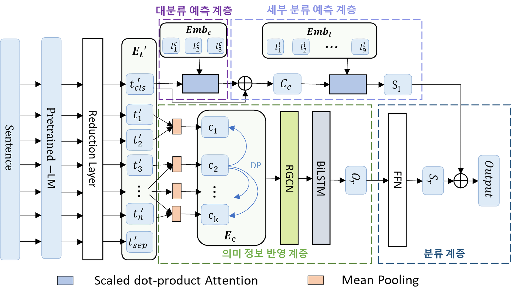

# Dual-Classification of Scientific Paper Sentence
1213522
Code for paper: Paper Sentence Rhetorical Classification Model using Label Embeddings and Dependency Parser

## Setting up the code environment

```
$ virtualenv --python=python3.6 venv
$ source venv/bin/activate
$ pip install -r requirements.txt
```

All code only supports running on Linux.

## Model Structure




## Data

*[국내 논문 문장 의미 태깅 데이터셋](https://aida.kisti.re.kr/data/8d0fd6f4-4bf9-47ae-bd71-7d41f01ad9a6)*

### Directory and Pre-processing
`의존 구문 분석 모델은 미공개(The dependency parser model is unpublished)`
```
├── data
│   ├── origin.json
│   └── origin
│       ├──DP_origin_preprocess.json
│       └── merge_origin_preprocess
│           ├── origin_train.json
│           └── origin_test.json
│           ├── new_train.json
│           └── new_test.json
├── KorSciBERT
│   └── cls
│       └── graph_concat_coarse_alpha
├── src
│   ├── dependency
│       └── merge.py
│   ├── functions
│       ├── biattention.py
│       ├── utils.py
│       ├── metric.py
│       └── processor.json
│   └── model
│       ├── main_functions_graph.py
│       └── model_graph_cls.py
├── run_graph.py
├── requirements.txt
└── README.md
```

* 원시 데이터(data/origin.json)를 의존 구문 분석 모델을 활용하여 입력 문장 쌍에 대한 어절 단위 의존 구문 구조 추출(data/origin/DP_origin_preprocess.json)

* 입력 문장 쌍에 대한 어절 단위 의존 구문 구조(data/origin/DP_origin_preprocess.json)를 src/dependency/merge.py를 통해 입력 문장 쌍에 대한 청크 단위 의존 구문 구조로 변환(data/origin/merge_origin_preprocess/origin.json)

* 학습 데이터와 평가 데이터를 세부분류별 4:1 비율로 나누기(data/origin/merge_origin_preprocess/origin_train.json, (data/origin/merge_origin_preprocess/origin_test.json))

* 입력 문장 쌍에 대한 어절 단위 의존 구문 구조를 가진 데이터(data/origin/DP_origin_preprocess.json)에 대하여 학습 데이터와 평가 데이터를 세부분류별 4:1 비율로 나누기(data/origin/merge_origin_preprocess/new_train.json, (data/origin/merge_origin_preprocess/new_test.json))


## Train & Test

* KLUE/BERT-base: `python run_graph.py`

## Results 

| Model | Macro F1 | Acc |
|---|--------- |--------- |
| KorSciBERT | 89.81% | 90.04% |
| proposed | 89.94% | 90.22% |
